::: {.column-screen}

```{=html}
<div class="story-hero story-hero--short">
  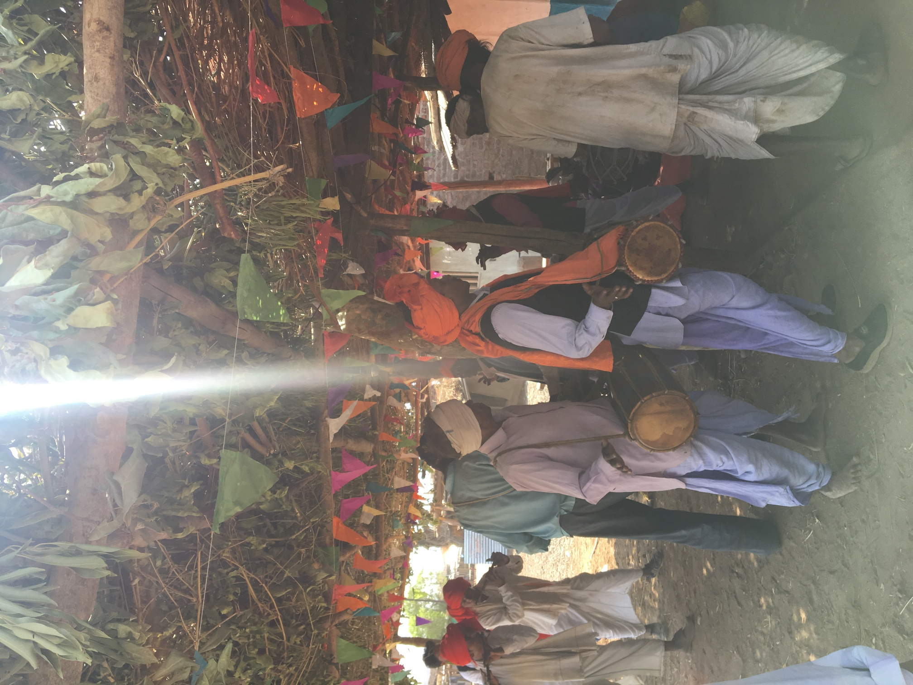
  <div class="story-hero__veil"></div>
  <div class="story-hero__text">
    <h1>Photos from the Field</h1>
  </div>
</div>
```

:::

::: {.column-screen-inset}

```{=html}
<div class="story-grid">

  <figure class="story-tile story-tile--bare">
    <span class="story-tile__frame">
      
    </span>
  </figure>

  <figure class="story-tile story-tile--bare">
    <span class="story-tile__frame">
      
    </span>
  </figure>

  <figure class="story-tile story-tile--bare">
    <span class="story-tile__frame">
      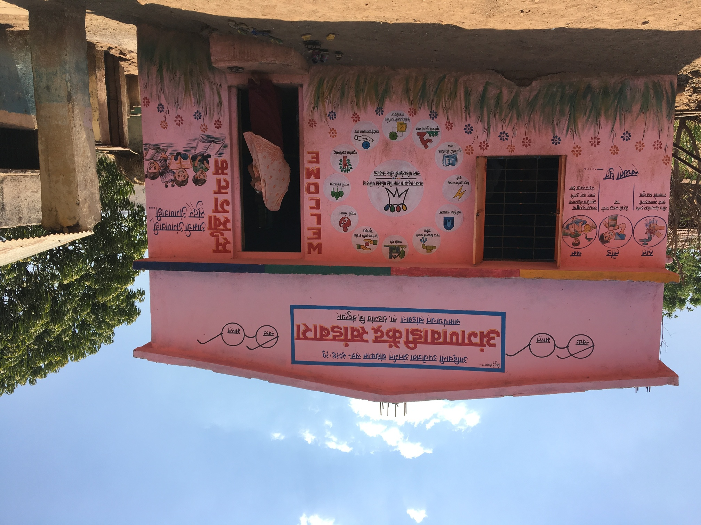
    </span>
  </figure>

  <figure class="story-tile story-tile--bare">
    <span class="story-tile__frame">
      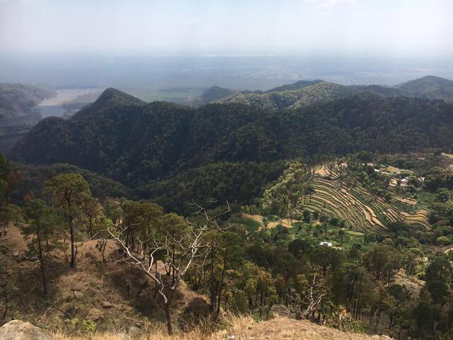
    </span>
  </figure>

  <figure class="story-tile story-tile--bare">
    <span class="story-tile__frame">
      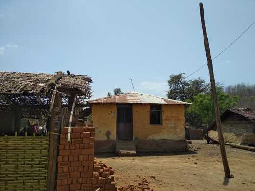
    </span>
  </figure>

  <figure class="story-tile story-tile--bare">
    <span class="story-tile__frame">
      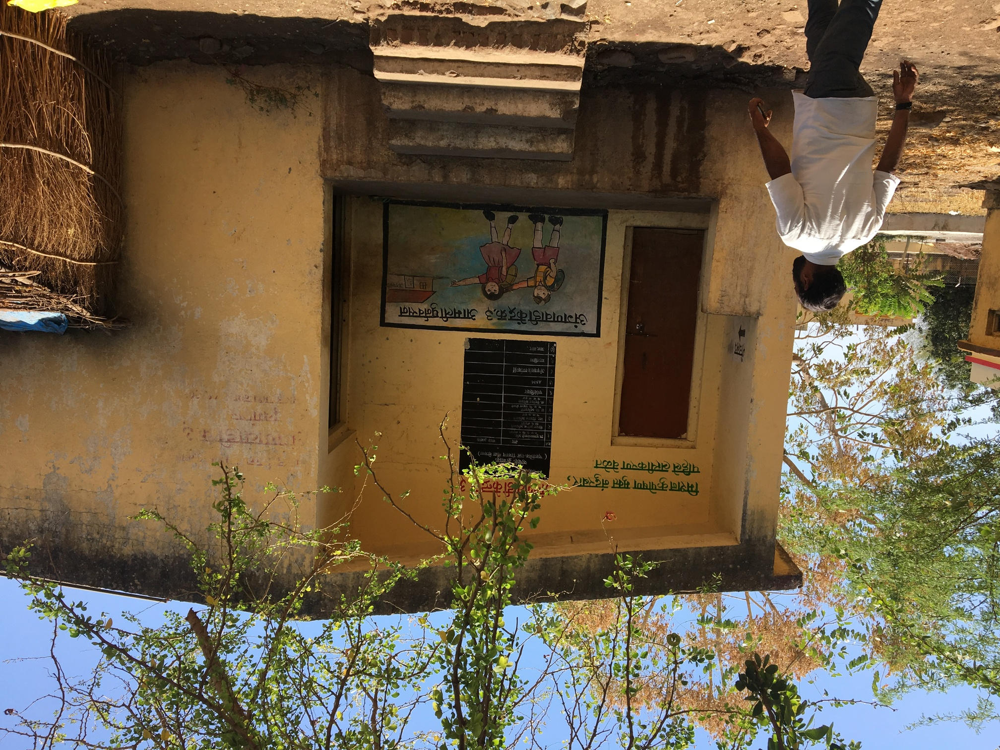
    </span>
  </figure>

  <figure class="story-tile story-tile--bare">
    <span class="story-tile__frame">
      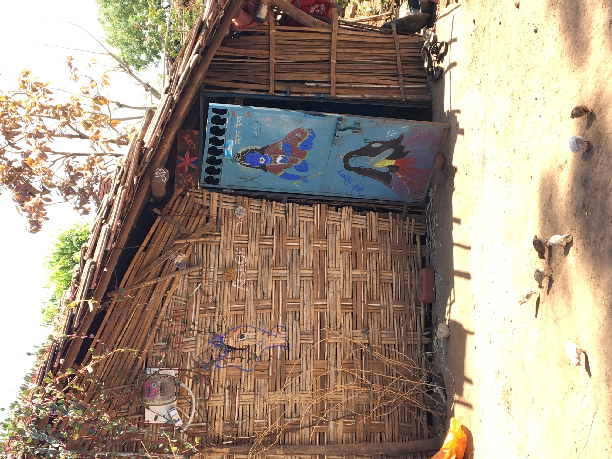
    </span>
  </figure>

  <figure class="story-tile story-tile--bare">
    <span class="story-tile__frame">
      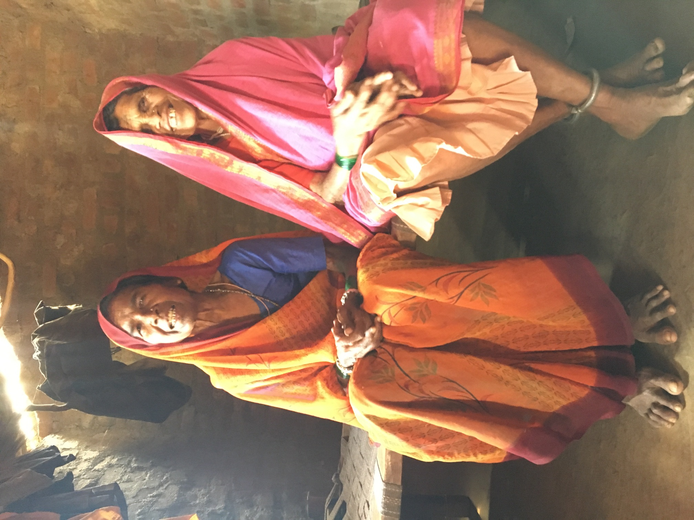
    </span>
  </figure>

  <figure class="story-tile story-tile--bare">
    <span class="story-tile__frame">
      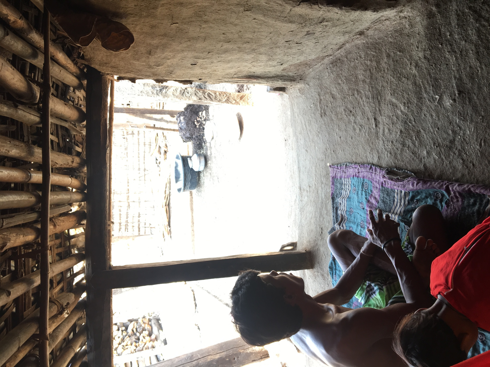
    </span>
  </figure>

  <figure class="story-tile story-tile--bare">
    <span class="story-tile__frame">
      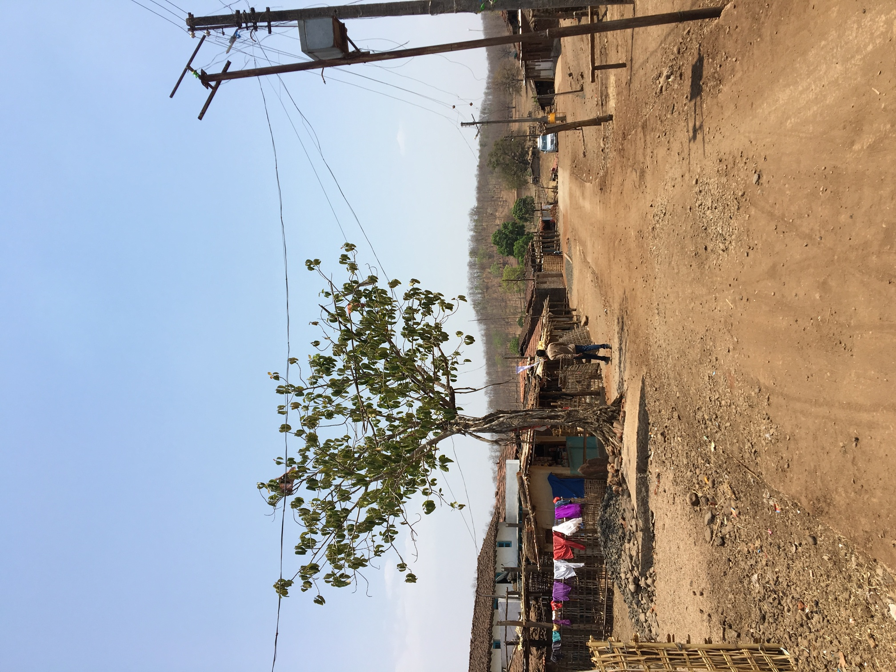
    </span>
  </figure>

  <figure class="story-tile story-tile--bare">
    <span class="story-tile__frame">
      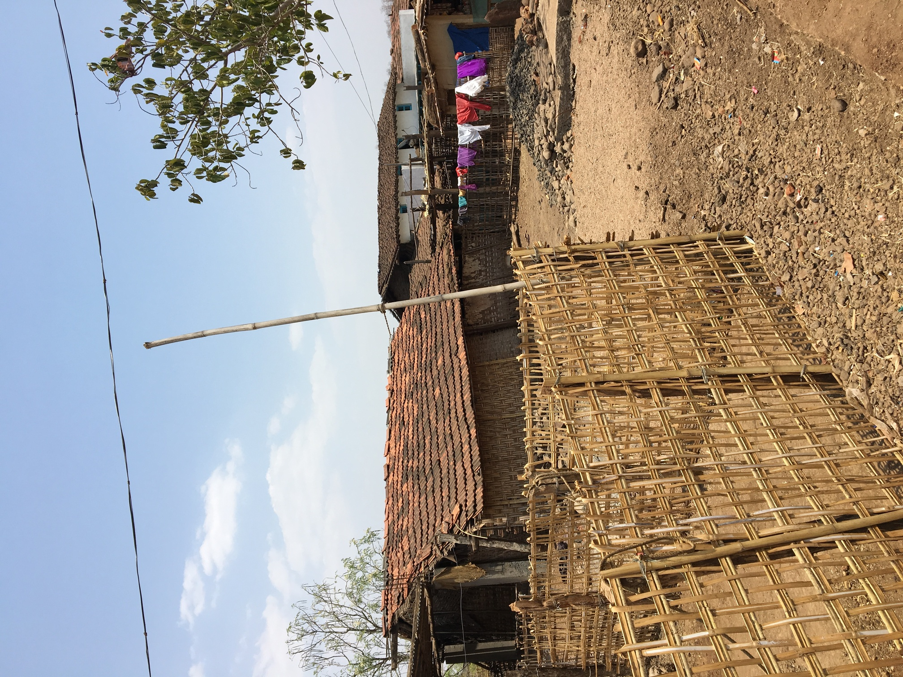
    </span>
  </figure>

  <figure class="story-tile story-tile--bare">
    <span class="story-tile__frame">
      
    </span>
  </figure>

  <figure class="story-tile story-tile--bare">
    <span class="story-tile__frame">
      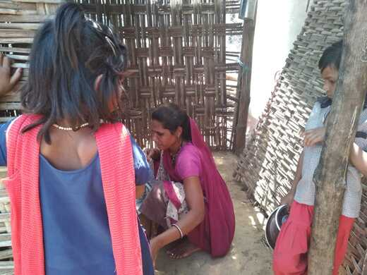
    </span>
  </figure>

  <figure class="story-tile story-tile--bare">
    <span class="story-tile__frame">
      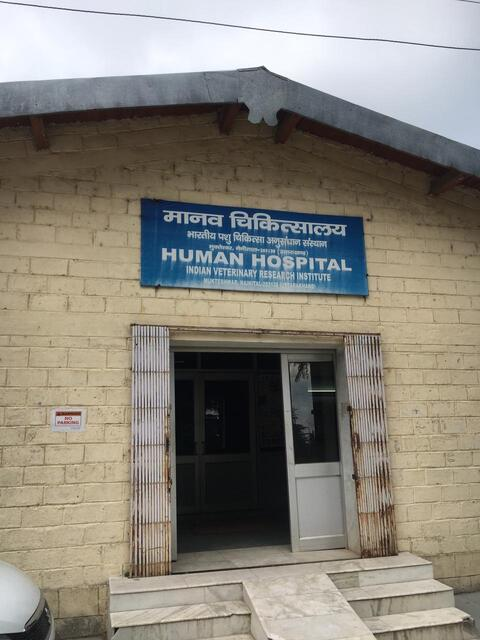
    </span>
  </figure>

</div>
```

:::
