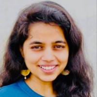

::: {.column-screen}

```{=html}
<div class="story-hero story-hero--tall" style="--hero-focus: center 18%;">
  
  <div class="story-hero__veil"></div>
  <div class="story-hero__text">
    <h1>Malvya Chintakindi</h1>
    <p class="story-hero__standfirst">
      Visiting Assistant Professor, Department of Anthropology, Western Washington University
    </p>
    <div class="story-hero__actions">
      <a class="btn-solid" href="field/index.qmd">Photos from the Field</a>
      <a class="btn-solid" href="dissertation/index.qmd">Dissertation Research</a>
    </div>
  </div>
</div>
```

:::

::: {.column-page}

```{=html}
<section class="split">
  <div class="split__media" style="--portrait-focus: center 38%;">
    
    <p class="split__name">Malvya Chintakindi</p>
    <p class="split__role">
      <span class="split__role-title">Visiting Assistant Professor, Department of Anthropology</span>
      <span class="split__role-inst">Western Washington University</span>
    </p>
    <div class="split__links">
      <a href="mailto:malvyac@uoregon.edu"><i class="bi bi-envelope"></i>Email</a>
      <a href="https://www.linkedin.com/in/malvya-chintakindi/"><i class="bi bi-linkedin"></i>LinkedIn</a>
      <a href="https://x.com/MalvyaC"><i class="bi bi-twitter-x"></i>X</a>
      <a href="cv/index.html"><i class="bi bi-file-earmark-text"></i>CV</a>
    </div>
  </div>
  <div class="split__body">
    <p>
      Hi! I am Malvya, a Visiting Assistant Professor in the
      <a href="https://chss.wwu.edu/anthropology">Department of Anthropology</a> at
      <a href="https://www.wwu.edu">Western Washington University</a>. I completed my PhD in
      Anthropology at the <a href="https://www.uoregon.edu">University of Oregon</a> (UO)
      in July 2026. I am from Hyderabad, a metropolitan city and a major IT and
      biotechnology hub in Southern India, Telangana state, India.
    </p>
    <p>
      My research focuses on how marginalized women navigate aspirations
      for a &ldquo;good life&rdquo; within the constraints of caste, class and
      informal labor in Hyderabad's urban settlements. This research was supported
      by the <a href="https://csws.uoregon.edu">Center for the study of women in Society</a>,
      UO, where I was a <a href="https://csws.uoregon.edu/funding">Jane Grant
      Dissertation Fellow for 2025-26</a>. This research has also been generously
      funded by the <a href="https://international.uoregon.edu">Division of Global Engagement</a>,
      <a href="https://gsi.uoregon.edu">Global Studies Institute</a>,
      <a href="https://socialsciences.uoregon.edu/asian-studies">Asian Studies Department</a>
      and the <a href="https://ohc.uoregon.edu">Oregon Humanities Center</a> at UO. I am passionate
      about global south collaborations, feminist and community based
      participatory research, program evaluation, and translating theory and
      research findings into real life applications.
    </p>
    <p>
      Prior to embarking on my doctoral journey, I was an international
      development practitioner for five years, working with grassroots
      research/implementation firms, international donor organizations and
      governments across India and Africa. I hold a background in public policy,
      development studies and journalism.
    </p>
  </div>
</section>
```

## News

::: {.news}

[Sep 2026]{.news-date}
Joined the [Department of Anthropology](https://chss.wwu.edu/anthropology) at Western Washington University as a Visiting Assistant Professor.

[Jul 2026]{.news-date}
Completed my PhD in Anthropology at the University of Oregon.

[2026]{.news-date}
Book chapter — "Dalit Intersectionality as Method and Theory: Women's Narratives from the Margins of Urban Progress," forthcoming in *Intersectionality beyond Eurocentrism*.

[2025]{.news-date}
"[Ethnography in Crisis — Fieldwork, Care, and Survival in Tumultuous Times](https://www.homefieldanthro.org/kitchen-floor-ethnography-knowledge-from-the-margins/)" published in the *Journal for the Anthropology of North America*.

[2025&ndash;26]{.news-date}
Jane Grant Dissertation Fellow at the Center for the Study of Women in Society, University of Oregon.

:::

:::

::: {.column-screen}

```{=html}
<section class="band band--dark" style="margin-bottom: 0;">
  <div style="max-width: min(44rem, 100%); margin: 0 auto; text-align: center;">
    <p style="margin-bottom: 1.8rem; font-size: 1.1rem;">
      Please write to me at malvyac@uoregon.edu to get in touch.
    </p>
    <a class="btn-solid" href="mailto:malvyac@uoregon.edu">malvyac@uoregon.edu</a>
    <p style="margin-top: 1.6rem; font-size: 0.9rem;">
      <a href="https://x.com/MalvyaC">X</a> &nbsp;&middot;&nbsp;
      <a href="https://www.linkedin.com/in/malvya-chintakindi/">LinkedIn</a>
    </p>
  </div>
</section>
```

:::
