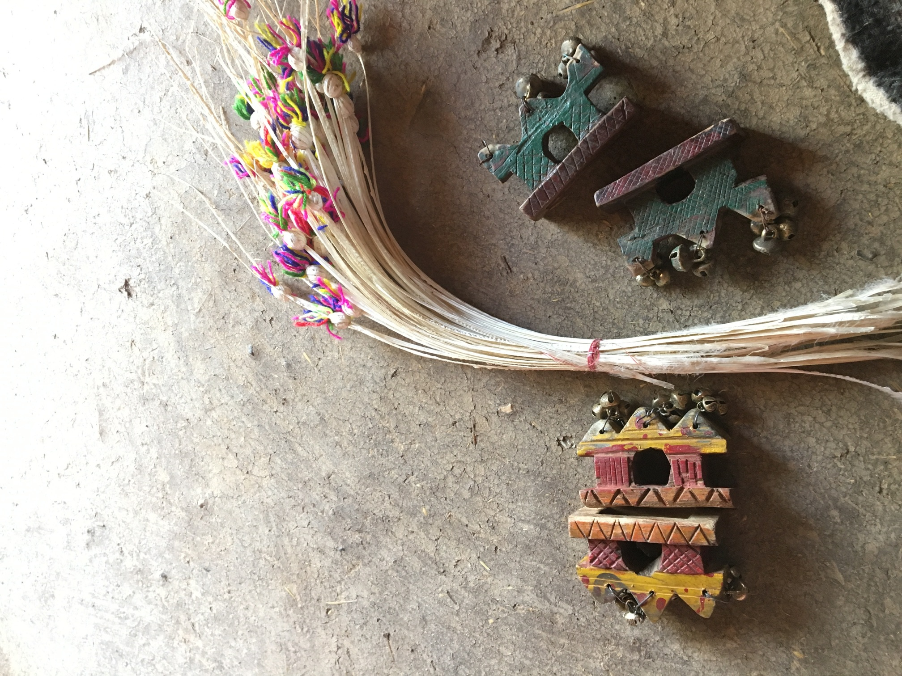

::: {.column-screen}

```{=html}
<div class="story-hero story-hero--short">
  
  <div class="story-hero__veil"></div>
  <div class="story-hero__text">
    <h1>Publications</h1>
  </div>
</div>
```

:::

::: {.prose}

## Book Chapters

```{=html}
<div class="pub-year-badge">2026</div>
```

**Dalit Intersectionality as Method and Theory: Women's Narratives from the Margins of Urban Progress** <br/>
*In Intersectionality beyond Eurocentrism (forthcoming)* <br/>
<a href="https://research.tuni.fi/inrenet/">Link Here</a>

## Peer-reviewed Articles

```{=html}
<div class="pub-year-badge">2026</div>
```

**Dreams Deferred: Navigating Urban Aspiration and Vulnerability among Informal Laborers in Hyderabad** <br/>
*Anthropology of Work Review (Under Review)*

```{=html}
<div class="pub-year-badge">2025</div>
```

**Ethnography in Crisis - Fieldwork, Care, and Survival in Tumultuous Times** <br/>
*Journal for the Anthropology of North America (JANA)* <br/>
<a href="https://www.homefieldanthro.org/kitchen-floor-ethnography-knowledge-from-the-margins/">Link Here</a>

```{=html}
<div class="pub-year-badge">2023</div>
```

**Informal Labor Blues: Gendered Effects of COVID-19 and Beyond on Women Belonging to Backward Castes in Hyderabad, India** <br/>
*Journal of the Indian Anthropological Society* <br/>
<a href="https://www.waunet.org/wcaa/archive/downloads/wcaa/dejalu/dejalu11-2/Journal-of-the-Indian-Anthropologica-Society.pdf">Link Here</a>

**Informal Labor Blues: Effects of COVID-19 on Dalit Caste Women in Hyderabad** <br/>
*Interdisciplinary Knowledge Series, Women's Studies Unit, Bhairab Ganguly College, New Delhi Publishers*

```{=html}
<div class="pub-year-badge">2019</div>
```

**Gender transformative approach to societal empowerment** <br/>
*Indian Journal of Women and Social Change* <br/>
<a href="https://doi.org/10.1177/2455632719836805">Link Here</a>

**Re-examining WASH Outcomes for Behaviour Change and Development: Case of two Districts in Bihar** <br/>
*Indian Association of Social Science Institutions (IASSI) Quarterly-Contributions to Indian Social Science* <br/>
with Saurabh Sood

## Research Essays, Op-Eds and Reports

```{=html}
<div class="pub-year-badge">2025</div>
```

**Dreams Deferred: Navigating Aspiration and Constraint in Urban India's Margins** <br/>
*Center for the Study of Women in Society (CSWS) Annual Review, University of Oregon*

```{=html}
<div class="pub-year-badge">2022</div>
```

**Informal Labor Blues: Gendered Effects of COVID-19 and Beyond on Backward Caste Women in India** <br/>
*Center for the Study of Women in Society (CSWS) Annual Review, University of Oregon*

**Let them Eat Cake: Narrative Around Food Amidst the Pandemic among Backward Communities in India** <br/>
*The Village Square Journal* with Prapti Adhikari

```{=html}
<div class="pub-year-badge">2020</div>
```

**3ie's Agricultural Innovation Evidence Programme: summary from our learning workshops** <br/>
*International Initiative for Impact Evaluation* with Mark Engelbert and Deeksha Ahuja <br/>
<a href="https://www.3ieimpact.org/sites/default/files/2020-09/TW4-Workshops-report.pdf">Link Here</a>

```{=html}
<div class="pub-year-badge">2019</div>
```

**Nourishing Hard to Reach Communities** <br/>
*Vihara Innovation Network for Reckitt Benckiser* with Gayathri Sreedharan, Divya Datta, Neha Jain <br/>
<a href="https://reacheachchild.com/pdf/Tribal%20Ethnography-Amravati%20&%20Nandurbar-%20Nutrition%20India%20Programme.pdf">Link Here</a>

**Change through Communities: Lessons from District Bureaucrats** <br/>
*Sehgal Foundation Newsletter* <br/>
<a href="https://www.smsfoundation.org/wp-content/uploads/2020/07/Change-Through-Communities.pdf">Link Here</a>

```{=html}
<div class="pub-year-badge">2018</div>
```

**Positive Deviance and Appreciative Inquiry: The story of slowly transforming Sadai** <br/>
*The Village Square Journal* <br/>
<a href="https://www.smsfoundation.org/news/positive-deviance-and-appreciative-inquiry-the-story-of-slowly-transforming-sadai-the-village-square/">Link Here</a>

**Do governance and development go hand in hand** <br/>
*New Delhi Times* with Saurabh Sood <br/>
<a href="https://www.newdelhitimes.com/do-governance-and-development-go-hand-in-hand/">Link Here</a>

**Measuring happiness and sustainable development in India** <br/>
*SDG Philanthropy Platform* with Saurabh Sood

```{=html}
<div class="pub-year-badge">2017</div>
```

**Rapid Assessment of the Phasing Out of Hazardous Pesticides in Dhoraji, Gujarat** <br/>
*Better Cotton Initiative* with Prerna Mukharya, Paramjeet Chawla <br/>
<a href="https://bettercotton.org/documents/rapid-assessment-of-phasing-out-a-hazardous-pesticide-in-dhoraji-gujarat-by-outline-india/">Link Here</a>

## Work in progress

**Navigating Margins: Gender, Identity, and Developmental Discourse among Ethnic Minorities** <br/>
*with* [Sayak Khatua](https://sayakkhatua.github.io)

**Threads of Survival: Kinship, Gender, and Intersectional Dynamics in Urban Slums** <br/>
*with* [Sayak Khatua](https://sayakkhatua.github.io)

:::
